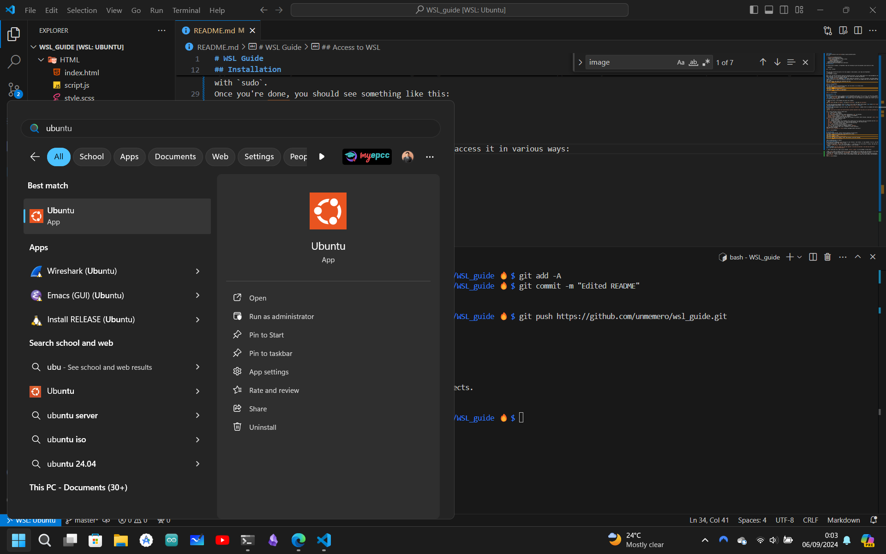

# WSL Guide
For a quick tutorial click [here](https://youtu.be/lG4xrh_Xuf4).
## Index

 - [Installation](#Installation)
 -  [Access to WSL](#Access to WSL)
 *  [First steps in WSL](#First steps in WSL)
	 * [Update](#Update)
	 * [Useful tools](#Useful tools)
- [VSCode Setup](#VS Code Setup)
- [Some extra shortcuts](#Some extra shortcuts)
## Installation

To install WSL on windows, in PowerShell type the following to get the available Linux distros for WSL.

```powershell

wsl --list --online

```
Once you have selected the distro (for this example I chose ubuntu), just type into PowerShell:
```powershell
wsl --install -d Ubuntu
```
Wait a bit, and the distribution should be installed correctly. If not, please email me to rgarcia117@miners.utep.edu
Once installed, it will let you know that you must type your username and password.
* Your username can be your windows username.
* <span style="color:red;">IMPORTANT:</span> When typing your password, it will be invisible. Just keep typing and be very careful you typed it correctly to avoid the headache of gaining access. This will also happen when you use command that require admin privileges with `sudo`.
Once you're done, you should see something like this:


[Back to Index](#Index)
## Access to WSL
Once you have [installed](#installation) WSL, you can access it in various ways:
- By opening up ubuntu or WSL on windows


- By typing `wsl` or `ubuntu` in PowerShell


[Back to Index](#Index)

## First Steps in WSL
### Update
The first step you want to do is install all your development tools you'll use. To do so, you must first update your system. 
<span style="color:red;">VERY IMPORTANT:</span> To copy in Linux terminal is `Ctrl + Shift + c`, and paste is `Ctrl + Shift + v`.
<span style="color:red;">VERY IMPORTANT:</span>Another thing, if your password is invisible don't worry, just hit enter after you typed it, even if you don't see it.

To update your WSL, in the command line paste this command:
```bash
sudo apt update && sudo apt upgrade -y && sudo apt autoclean -y && sudo apt autoremove
```
Hit enter and type your password. Once it's done, It will show the regular bash prompt (<span style="color:lightgreen;">yourUsername@yourComputerName:</span> <span style="color:blue;">~ $</span>).
### Useful tools
To install your development tools we'll use the `apt install <programs>` command. Here's an example with some useful programs you may want to include
```bash
sudo apt install git vim emacs bat build-essential python3 openjdk-17-jdk 7zip tmux curl net-tools wireshark jq tree neofetch zsh
```
Just a quick overview of each of these tools:
- `git`: source control software.
- `vim` and `emacs`: text editors.
- `bat`: file concatenator, but with syntax highlighting (`cat` on steroids).
- `build-essential`: Installs `C` and `C++` compilers and debuggers.
- `python3`: Installs python3 into your WSL terminal
- `openjdk-17-jdk`: Installs java 17 into your WSL terminal (To install other versions, type apart `javac --version`, and just replace the `17` for the version number you need).
- `7zip`: a file compression tool.
- `tmux`: Terminal splitter.
- `curl`: Terminal web request tool (Probably you'll mostly use it to install tools not available with the `apt` package manager).
- `net-tools`: Network analysis tools (To start learning hacking, but the ethical kind).
- `wireshark`: Web traffic analysis tool. Install at your own risk
- `jq`: A `json` processor in your terminal.
- `tree`: Lets you see the file structure of a directory
- `neofetch`: Run it. No terminal is complete without `neofetch`.
- `zsh`: The mac terminal (But I don't recommend it unless necessary).
Some additional packages:
[Ubuntu – List of sections in "focal"](https://packages.ubuntu.com/focal/)

[Back to Index](#Index)

## VS Code Setup
To setup VS Code with WSL, install the WSL extension from Microsoft.
From there, click on the blue icon in the bottom left corner.

Then select connect to WSL

After this just open your folders, files, and projects, and start working


[[WSL Guide#Index|Back to Index]]
## Some extra shortcuts
You can add some recommended quick shortcuts to your terminal, like folders, or long commands. To do so, and other terminal customizations, we edit the `.bashrc` file.
1. To do so, open your `.bashrc` file in your home (`~`) directory on your text editor of choice. Then add the following lines, but replacing `<yourUsername>` with your actual Windows or Linux username.
```bash
alias fullupdate='sudo apt update && sudo apt upgrade -y && sudo apt autoclean -y && sudo apt autoremove'
export pc="/mnt/c/Users/<yourUsername>/"
```
2. After saving the file, type in your terminal `source ~/.bashrc` for the changes to take effect.

* What `alias` does is create a shortcut for a long command. Make it for those you use recurrently. On the other hand, `export` stores a variable which can be accessed via `$variableName`. It is mostly use to shorten paths to files. 
* With the `pc` variable from above, you can type in your terminal `cd $pc`, and it will move to the directory `/mnt/c/Users/<yourUsername>/`, which is your user folder in your Windows system (AKA, where you have folders like Documents, Downloads, Pictures, etc.)
[Back to Index](#Index)